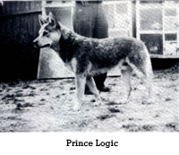
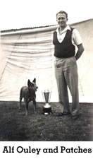
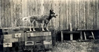
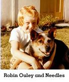
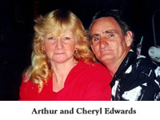
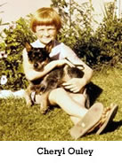

Alfred James Ouley was only a child when given his first Cattle Dog by his grandfather. His first registered bitch was Aust CH Starlight Patsy, bought from Mr S Robinson in 1949. He paid fifteen pound for her in pup to Hillsview Logic's Successor.

Prince Logic was Alf's first registered male whom he also purchased in 1949, again from Mr S Robinson.

Aust CH Trueblue Patches was Alf's best male. Patches dam, Turrella Pride was bred by Alf and given to Mr Swinerd of Mascot in exchange for pick of the litter. When the time came, Mr Swinerd kept the pick of the litter for himself, so Alf had to take second pick, which was Patches (whelped April 23, 1951)

Alf married Nell and they moved to Sans Souci where they built their home themselves. Nell still lives there today, Alf passed away on 27th Oct, 2008. Patches became a champion within four months of showing. He won Best In Show at the Sydney Sheep Show on May 31, 1952 (only a junior). Nell was not at that show, she was seven months pregnant with me (Cheryl). Next year Patches won Best of Breed at the 1953 Sydney Royal. At the advice of Jackie Smith, Patches was retired after that Royal and not show again unfortunately until 1957 when he was sent to Melbourne, to Jimmy Stewart to help the breed as a stud dog. He was shown down there for only a year, where, after winning at Pakenham and District A.H Society show on March 8, 1958, he took ill and despite the efforts of two vets, died at the age of 7.

Alf and Nell's best bitch was Aust CHCambridge Needles whelped June 6th, 1953. She was given to Alf in exchange for a service to Patches. Needles won reserve challenge at the 1955 Sydney Royal and Best of Breed at the 1956 Sydney Royal.

The "Turrella " prefix started in 1949, named after the railway station in Arncliffe where Alf lived with his parents at the time. Only eight litters were bred, Alf and Nell stopped showing in the mid 60's, just like today, Alf got fed up with the corrupt judging. Their last cattle dog was Talaringa Cindi, she was killed in 1970.

Alf and Nell's eldest daughter Cheryl married Arthur Edwards in 1971 and later moved to Waterfall in 1974 where they still live.

Our first cattle dog was Aust CH Taits Glen Red Sonny, bred by Joe Tait of Bexley (Joe died in 1987). On Alfs advice, Sonny was shown and became one of the top dogs in his time, winning two Best In Shows All Breeds and Runner Up to Best In Show at the Australian Cattle Dog Society of NSW on 13/9/81 (Mrs Bernice Walters of Wooleston Kennels was the judge) and many Best In Groups and In Shows. At the time, red cattle dogs were hard to win with. Sonny was our foundation dog.

Our first bitch was Meena Melody (red) and when put to Sonny we had our first litter in 1979, seven red dogs and one blue bitch. We kept the bitch and that was Aust CH Whitefence Blue Tammy.

"Whitefence" was our first prefix. After two litters my father transferred his prefix over to me in 1983. We have had many good dogs over the years who have done well in the ring, the dogs have won on THEIR MERITS, not like some where the handlers are the winners.

I have been raised with cattle dogs and Arthur and I have been showing and breeding for over 30 years. Although we have many good dogs and breed lovely puppies, we always aim to improve. So far we have exported 68 dogs to 19 countries and either bred or owned 66 champions, 1 Int Ch and 2 Grand Champions as well as 4 Obedience titles.

Countries that we have exported to so far are - New Zealand, America, Switzerland, New Caledonia, Philippines, Finland, Japan, South Africa, Kenya, Canada, Ireland, Germany, France, Nederlands, Pakistan, Hong Kong U.K., Italy & Peru.